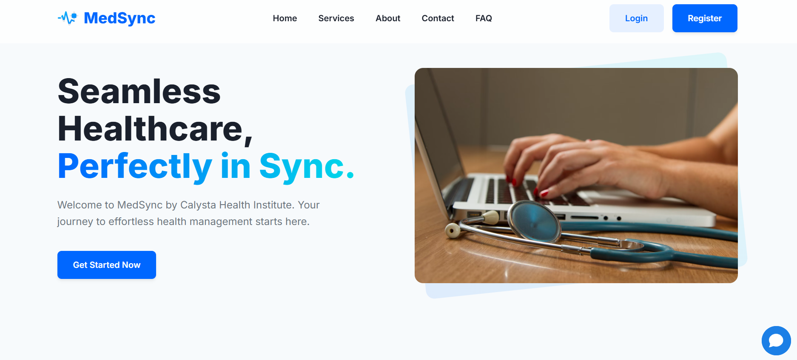
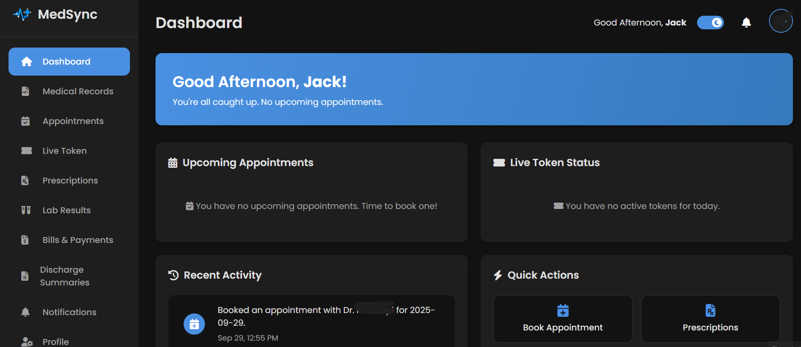
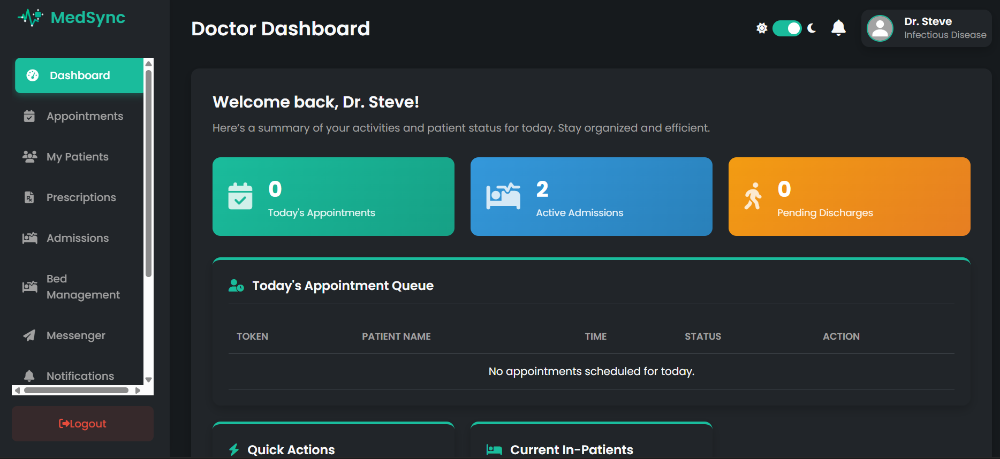
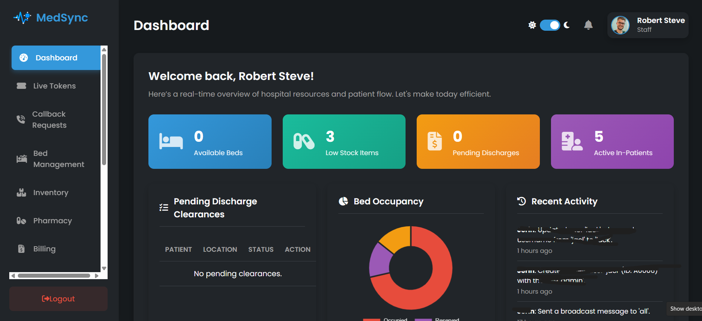
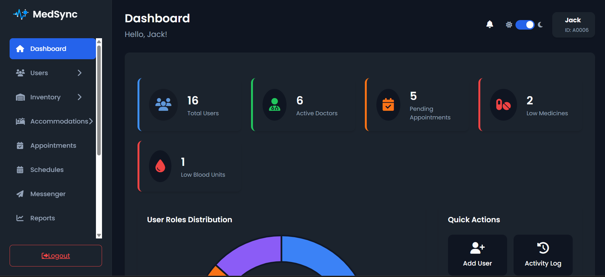

# MedSync Healthcare Platform

<p align="center">
  
</p>

<p align="center">
  
  
  
  
  
  
</p>



<p align="center">
  <strong>MedSync is a state-of-the-art, web-based Healthcare Information System (HIS) designed to streamline hospital operations, enhance patient care, and improve administrative efficiency.</strong>
</p>

<p align="center">
    <a href="#-key-features">Key Features</a> •
    <a href="#-technology-stack">Technology Stack</a> •
    <a href="#-user-roles--functionalities">User Roles</a> •
    <a href="#-installation-and-configuration">Installation</a> •
    <a href="#-usage">Usage</a> •
    <a href="#-contributing">Contribute Now</a>
</p>


MedSync is a comprehensive, web-based platform built to automate critical hospital workflows, including appointment scheduling, live token tracking, billing, prescription management, admissions, and discharges. The platform provides a secure, responsive, and user-friendly interface for Administrators, Doctors, Staff, and Patients, ensuring tailored functionality and seamless communication across all departments.

---
## ✨ Key Features

* **Role-Based Access Control (RBAC)**: Four distinct user roles (Administrator, Doctor, Staff, Patient) with specific permissions and tailored dashboards to ensure data security and operational efficiency.
* **Comprehensive User Management**:
    * Secure user registration with OTP email verification and Google Sign-In options.
    * Password reset functionality with expiring OTPs sent via email.
    * Sequential and role-prefixed User ID generation (e.g., `U0001`, `D0001`).
    * Detailed audit logs for all critical system actions.
* **Dynamic Appointment & Token System**:
    * Real-time appointment booking based on doctor availability and a "Search Doctor" function.
    * A flexible live token system for efficient queue management.
* **Automated Discharge Process**: A multi-step workflow initiated by doctors and cleared sequentially by nursing and pharmacy teams before final bill generation and settlement. Discharge summaries are automatically generated as PDFs and can be emailed to the patient.
* **Integrated Healthcare Services**:
    * Digital prescription management with inventory checks.
    * Secure access to patient medical records, including lab results, prescriptions, and admission history.
    * Generation of downloadable PDF lab reports and discharge summaries.
* **Resource & Inventory Management**:
    * Color-coded interface to track bed availability (available, occupied, cleaning).
    * Real-time monitoring of medicine and blood inventories with low-stock alerts.
* **Robust Notification System**: Automated email and system alerts for appointments, billing, password resets, and other critical events, powered by **PHPMailer**.
* **Advanced Security Protocols**: Implements password hashing, CSRF token protection, prepared statements to prevent SQL injection, Google reCAPTCHA, and secure session management.
* **In-depth Reporting**: Generation of comprehensive PDF reports on revenue, bed occupancy, and patient statistics for administrators.

---

## 💻 Technology Stack

* **Backend**: PHP
* **Database**: MySQL
* **Frontend**: HTML, CSS (custom styles, no frameworks), JavaScript
* **Backend Libraries**:
    * **PHPMailer**: For sending all system emails (OTP, notifications, etc.).
    * **dompdf**: For generating PDF documents like invoices and reports.
    * **Firebase PHP JWT**: For verifying Google Sign-In tokens on the backend.
* **Authentication**: Google Firebase Authentication (for Google Sign-In)
* **Security**: Google reCAPTCHA
* **Server Environment**: XAMPP with Apache

---

## 👥 User Roles & Functionalities

The platform supports four distinct user roles, each with a dedicated dashboard and specific permissions:

### **Patient**

* **Appointments**: Book, view live token status, and cancel appointments.
* **Medical Information**: Access and download personal prescriptions, bills, lab results, and discharge summaries as PDFs.
* **Profile Management**: Edit personal details and manage account security settings.
* **Communication**: Receive system notifications.



### **Doctor**

* **Patient Care**: Manage patient admissions, appointments, and prescriptions.
* **Discharge Process**: Initiate patient discharge requests, triggering the automated multi-step clearance process.
* **Record Management**: Access patient medical records, view history, and input lab results.
* **Scheduling**: Manage personal availability and define appointment time slots.



### **Staff**

* **User Management**: Add, edit, and remove Patient and Doctor accounts.
* **Admissions & Discharge**: Manage the full admission process and execute multi-step discharge confirmations (nursing, pharmacy, billing).
* **Medication Dispensing**: View pending prescriptions and generate corresponding bills.
* **Inventory & Resource Management**: Track and update the status of beds, medicines, and blood inventory.
* **Live Tokens**: Monitor live token queues for doctors.



### **Administrator**

* **Comprehensive User Management**: Add, edit, and remove all user accounts, including other admins, doctors, and staff.
* **System Configuration**: Manage system-wide settings like departments, wards, and email configuration.
* **Reporting & Auditing**: Generate detailed financial, patient, and resource reports, and view activity logs for all critical system actions.
* **Security**: Manage IP blocking and view login histories.
* **System Maintenance**: Perform database backups directly from the dashboard.



---
## 🛠️ Installation and Configuration

Follow these steps to set up the MedSync Healthcare Platform locally.

### **Prerequisites**

Make sure you have these :-
* [XAMPP](https://www.apachefriends.org/download.html)
* [Composer](https://getcomposer.org/)
* [Git](https://git-scm.com/downloads)
* [VS Code](https://code.visualstudio.com/download) or any other edittors.

### **1. Clone the Repository**

1. Go to `\xampp\htdocs` and clone the file there
```bash
git clone https://github.com/dev-jerin/medsync.git
```
2. Open the medsync folder in vscode or other editor.
### 2. Database Setup
1.  Start Apache and MySQL services from the XAMPP Control Panel.
2.  Navigate to `http://localhost/phpmyadmin`.
3.  Create a new database named `medsync`.
4.  Import the provided `medsync.sql` file to create all necessary tables and initial data.

### 3. Configure the Application
1. Update the admin details in database for initial login as a new admin.
2.  Update your system email and Gmail App Password in the `system_settings` table in the database for PHPMailer to work.
3. Go to [Firebase Console](https://console.firebase.google.com/) and enable google authentication.
4.  Add your Firebase configuration to `.env` (see `.env.example`).
5.  Set up your Firebase service account credentials:
    *   Download your service account JSON file from the Firebase Console.
    *   Rename it to `firebase_credentials.json` and place it in the `_private/` directory.
    *   (Optional) You can use `_private/firebase_credentials.example.json` as a reference for the expected structure.
6. Create your Google reCAPTCHA KEY SECRET from [here](https://www.google.com/recaptcha/admin/create)

### 4. Install Dependencies
Install the required PHP libraries using Composer.
```bash
composer install
```
This will install phpmailer, dompdf, and firebase/php-jwt into the vendor/ directory as specified in composer.json.

### 5. Configure Apache
Ensure your Apache configuration (.htaccess) is set up correctly to handle clean URLs and custom error pages. The provided .htaccess file is pre-configured for this.

### 6. Additional
You can add an AI Chatbot by making it from [chatling.ai](https://chatling.ai/) and adding it to the footer of home page.

### 7. Hosting
You can host this for free with the help of [infinityfree](https://www.infinityfree.com/)


---
## 🚀 Usage
Open XAMPP and start Apache and MySQL.

Open your browser and navigate to http://localhost/medsync/ (URL may change based on port you use). 

Register a new account (requires email-based OTP verification) or log in with the default admin credentials (admin / password) to access the admin dashboard.

---
## 🛡️ Security Features
* **Password Hashing:** User passwords are securely hashed using PASSWORD_BCRYPT.

* **CSRF Protection:** All forms are protected against Cross-Site Request Forgery attacks using session-based CSRF tokens.

* **SQL Injection Prevention:** The application exclusively uses prepared statements for all database queries to prevent SQL injection.

* **Google reCAPTCHA:** The login and registration forms are protected by Google reCAPTCHA v2 to prevent automated abuse and spam.

* **Secure Session Management:** Sessions are regenerated upon login to prevent fixation attacks, and an inactivity timeout is enforced.

* **IP Blocking:** Administrators can monitor and block suspicious IP addresses from accessing the platform.

* **Role-Based Access Control:** Strict server-side checks ensure that users can only access data and perform actions permitted for their role.

---
## ⚠️Troubleshoot
**Mail not send or error while requesting a mail or other issues in mail** <br>
<i>Causes</I>:- <br>
1. Gmail address or App password in `system _settings` table in database not correct.
2. Composer version not updated, for this run `composer update` in root and run `composer install` again.

**Some pages not running due to `Uncaught mysqli_sql_exception`** <br>
<i>Causes</I>:- <br>
1. MySQL stopped running, go to XAMPP and check MySQL.

**CAPTCHA not working**
<br>
<i>Causes</I>:- <br>
1. Possibly due to to wrong KEY and SECRET, check `_private/recaptcha_config.php/`

---
## 🤝 Contributing

Contributions are what make the open-source community such an amazing place to learn, inspire, and create. Any contributions you make are **greatly appreciated**. Before contributing, please read our [CONTRIBUTING.md](CONTRIBUTING.md) for guidelines and standards.

---

## 🙏 Acknowledgements

This project would not have been possible without these amazing open-source libraries:

* [PHPMailer](https://github.com/PHPMailer/PHPMailer)
* [dompdf](https://github.com/dompdf/dompdf)
* [Firebase PHP JWT](https://github.com/kreait/firebase-php)
* [Chart.js](https://www.chartjs.org/)


## 👥 Contributors

A big thanks to the core developers who have brought this project to life:

<table>
  <tr>
    <td align="center">
      <a href="https://github.com/dev-jerin">
        
        <br />
        <sub><b>Jerin Sigi<br> (Main Contributor)</b></sub>
      </a>
    </td>
    <td align="center">
      <a href="https://github.com/SEBINKSHAJI">
        
        <br />
        <sub><b>Sebin K Shaji</b></sub>
      </a>
    </td>
  </tr>
</table>

---
## License

Distributed under the AGPL-3.0 License. See `LICENSE` for more information.
